 
<br><br>


###  <div style="text-align: right">  Data Engineering - P2024 <br> <br>  <time datetime="2024-05-29">2024/03/19</time> <br> <br> <u>Name </u>: DAIPA Blandine </div>
<br> 


#   <center>  **DEVOPS** </center>


# TP PART 01 - Docker

## 1. Database

### Basics

To build the database image, use the following command:

```bash
docker build -t my-database .
```
And then I create my network using:
```bash
docker network create my-network
```
I run the admirer to o enable adminer/database communication
```bash
docker run --name adminer -p 8080:8080 --network my-network -d adminer
```
I run my database with the name #mypostgres with their informations like user, password, server and the port.
```bash
docker run --network my-network --name mypostgres -p 5432:5432 -e POSTGRES_DB=db -e POSTGRES_USER=usr -e POSTGRES_PASSWORD=pwd my-database
```
#### Explanation:

* docker build: Builds the Docker image from the Dockerfile.
* docker network create: Creates a Docker network for communication between containers.
* docker run: Executes the Docker container for Adminer, a database administration tool, on port 8080.

#### Tips
To establish communication between your database and Adminer, you need to ensure that they are connected to the same Docker network. You can achieve this by executing the following command:
```bash
docker network connect app-network mypostgres
```
#### Dockerfile
We have created a Dockerfile with the following specifications:
```Dockerfile
FROM postgres:14.1-alpine

ENV POSTGRES_DB=db \
   POSTGRES_USER=usr \
   POSTGRES_PASSWORD=pwd
COPY 01-CreateScheme.sql /docker-entrypoint-initdb.d/01-CreateScheme.sql
COPY 02-InsertData.sql /docker-entrypoint-initdb.d/02-InsertData.sql

```
#### Explanation:

* We start with the base image postgres:14.1-alpine.
* We set environment variables for the PostgreSQL database: POSTGRES_DB, POSTGRES_USER, and POSTGRES_PASSWORD.
* We copy the SQL scripts 01-CreateScheme.sql and 02-InsertData.sql into the /docker-entrypoint-initdb.d/ directory within the container. These scripts will be executed automatically when the PostgreSQL container starts, initializing the database schema and inserting initial data.

## 2. Initializing the Database

### SQL Scripts
We have create .sql (01-CreateScheme.sql and 02-InsertData.sql)fichier in the same folder with Dockerfile
#01-CreateScheme.sql

```SQL
CREATE TABLE public.departments
(
 id      SERIAL      PRIMARY KEY,
 name    VARCHAR(20) NOT NULL
);

CREATE TABLE public.students
(
 id              SERIAL      PRIMARY KEY,
 department_id   INT         NOT NULL REFERENCES departments (id),
 first_name      VARCHAR(20) NOT NULL,
 last_name       VARCHAR(20) NOT NULL
);

```
#02-InsertData.sql

```SQL
INSERT INTO departments (name) VALUES ('IRC');
INSERT INTO departments (name) VALUES ('ETI');
INSERT INTO departments (name) VALUES ('CGP');

INSERT INTO students (department_id, first_name, last_name) VALUES (1, 'Eli', 'Copter');
INSERT INTO students (department_id, first_name, last_name) VALUES (2, 'Emma', 'Carena');
INSERT INTO students (department_id, first_name, last_name) VALUES (2, 'Jack', 'Uzzi');
INSERT INTO students (department_id, first_name, last_name) VALUES (3, 'Aude', 'Javel');

```
# Explanation :

* SQL scripts are executed during the creation of the Docker image to initialize the database with its structure and data.
* We need to rebuild the Docker image of our database to see our tables in Adminer.

## 3. Persist data

To be abble to do that we have run this command:

```bash
docker run -v /Users/daipablandine/Desktop/Devops/data:/var/lib/postgresql/data --name mypostgres -p 5432:5432 -e POSTGRES_DB=db -e POSTGRES_USER=usr -e POSTGRES_PASSWORD=pwd my-database
```
# Explanation :

In this command:

* --name mypostgres gives a name to our container (here, "mypostgres").
* -v /Users/daipablandine/Desktop/Devops/data:/var/lib/postgresql/data specifies the volume. "/Users/daipablandine/Desktop/Devops/data" is the directory on our host machine where you want to store the database data, and "/var/lib/postgresql/data" is the directory inside the container where PostgreSQL stores its data.
* postgres:14.1-alpine is the Docker image we use for our PostgreSQL database, along with its specific version.

## 3. Backend API 

#Basics

To begin, we'll create a simple Java hello-world application and then proceed to build a Spring Boot application providing a simple API.

#Java Hello World:
In the file Main.java, we define a basic Java class to print "Hello World!" to the console:

```java
public class Main {

   public static void main(String[] args) {
       System.out.println("Hello World!");
   }
}
```
We compile this Java class using the following command:

```java
javac Main.java
```
#Dockerfile Configuration:

We configure the Dockerfile to handle both the build and run stages of our Spring Boot application.

```Dockerfile
# Build
FROM maven:3.9.6-amazoncorretto-21 AS myapp-build
ENV MYAPP_HOME /opt/myapp
WORKDIR $MYAPP_HOME
COPY pom.xml .
RUN mvn dependency:go-offline
COPY src ./src
RUN mvn package -DskipTests

# Run
FROM amazoncorretto:21
ENV MYAPP_HOME /opt/myapp
WORKDIR $MYAPP_HOME
COPY --from=myapp-build $MYAPP_HOME/target/*.jar $MYAPP_HOME/myapp.jar

ENTRYPOINT java -jar myapp.jar
```
# Explanation :

* Build Stage (myapp-build):

** Uses a Maven-based image (maven:3.9.6-amazoncorretto-21) to compile the Spring Boot application.
** Copies the pom.xml file to resolve dependencies and downloads them offline.
** Copies the source code (src) and builds the application JAR without running tests.

* Run Stage:

** Switches to an Amazon Corretto JDK-based image (amazoncorretto:21).
** Copies the built JAR file from the build stage.
** Sets the command to run the Spring Boot application using java -jar myapp.jar.

To build my Java API, I use the following command:

```bash
docker build . -t java_api
```
This command builds a Docker image for my Java API using the current directory (.) as the build context and tags the image with the name java_api.

Then, to see "Hello World" printed in my terminal, I run the following command:

```bash
docker run java_api
```
This command runs a container from the java_api image, executing the Java application inside it. As a result, "Hello World" is displayed in the terminal output of the running container.

## Multistage build

In the directory /Users/daipablandine/Desktop/Devops/simpleapi/src/main/java/fr/takima/training/simpleapi/Controller, we create a file named GreetingController.java with the following specifications:

```bash
package fr.takima.training.simpleapi.Controller;

import org.springframework.web.bind.annotation.*;

import java.util.concurrent.atomic.AtomicLong;

@RestController
public class GreetingController {

   private static final String template = "Hello, %s!";
   private final AtomicLong counter = new AtomicLong();

   @GetMapping("/")
   public Greeting greeting(@RequestParam(value = "name", defaultValue = "World") String name) {
       return new Greeting(counter.incrementAndGet(), String.format(template, name));
   }

   record Greeting(long id, String content) {}

}
```
Next, we add a Dockerfile to the same directory to enable building and running the application.

Here's an example of how the Dockerfile might look:

```Dockerfile
# Build
FROM maven:3.9.6-amazoncorretto-21 AS myapp-build
ENV MYAPP_HOME /opt/myapp
WORKDIR $MYAPP_HOME
COPY pom.xml .
RUN mvn dependency:go-offline
COPY src ./src
RUN mvn package -DskipTests

# Run
FROM amazoncorretto:21
ENV MYAPP_HOME /opt/myapp
WORKDIR $MYAPP_HOME
COPY --from=myapp-build $MYAPP_HOME/target/*.jar $MYAPP_HOME/myapp.jar

ENTRYPOINT java -jar myapp.jar
```
# Explanation :

This Dockerfile follows a multistage build approach:

* Stage 1 (build):

** Uses a Maven-based image to compile the Spring Boot application.
** Copies the project files and runs the Maven package command to build the application JAR.
** Stage 2 (runtime):

* Switches to a lightweight JDK image for runtime.

** Copies the built JAR file from the build stage.
** Exposes port 8080 for incoming connections.
** Specifies the command to run the application JAR file.
** With this Dockerfile in place, you can build and run the Spring Boot application using Docker.

After that, I build and run my simpleapi application using Docker with the following commands:

```bash
docker build -t simpleapi . 
docker run --name spring -d -p 8082:8080 simpleapi
```
These commands build the simpleapi Docker image and then run a container named spring from that image. The container is detached (-d), meaning it runs in the background, and port 8080 of the container is mapped to port 8082 on the host (-p 8082:8080).

When you open localhost, you should see the JSON response {"id":8,"content":"Hello, World!"}, indicating that the API is functioning correctly and responding with a greeting message.

# Answer of question:

A multistage build in Docker is used to optimize the Docker image size and improve build performance. It involves defining multiple build stages in a single Dockerfile, each serving a specific purpose.

## Backend API

TO do this we download the source code of simpleapi and then we configure the file application.yml like this:

```yaml
spring:
  jpa:
    properties:
      hibernate:
        dialect: org.hibernate.dialect.PostgreSQLDialect
        jdbc:
          lob:
            non_contextual_creation: true
    generate-ddl: false
    open-in-view: true
  datasource:
    url: jdbc:postgresql://mypostgres:5432/db
    username: usr
    password: pwd
    driver-class-name: org.postgresql.Driver
management:
  server:
    add-application-context-header: false
  endpoints:
    web:
      exposure:
        include: health,info,env,metrics,beans,configprops
```
Next, we proceed to build and run the Docker image:

```bash
docker build -t backendapi . 
docker run --name springapi -d -p 8082:8080 backendapi
```
With these endpoints  /departments/IRC/students on localhost, you can see this:

```Configuration
<VirtualHost *:80>
ProxyPreserveHost On
ProxyPass / http://my-backend:8080/
ProxyPassReverse / http://my-backend:8080/
</VirtualHost>
LoadModule proxy_module modules/mod_proxy.so
LoadModule proxy_http_module modules/mod_proxy_http.so
```
This configuration sets up the HTTP server as a reverse proxy to route requests to a backend API running at http://backendapi:8080/. Ensure that the backendapi hostname corresponds to the address of your backend API container within the Docker network.

# Answer of question:

A reverse proxy serves as an intermediary between clients and backend servers, efficiently distributing incoming web traffic to optimize performance and ensure high availability. It enhances security and privacy by shielding backend servers from direct exposure to external clients and offers SSL/TLS termination capabilities, simplifying certificate management and offloading decryption tasks. Additionally, reverse proxies improve performance by caching static content, reduce server load, and provide robust security features like content filtering and access control, fortifying defenses against malicious attacks and unauthorized access attempts.

## 5. Link application

To link our applications together using Docker Compose, we define a docker-compose.yml file with the following structure:

```yaml
version: '3.7'

services:
    backend:
        container_name: my-backend
        build:
            context: "/Users/daipablandine/Desktop/Devops/simple-api-student-main"
        networks:
            - my-network
        depends_on:
            - database

    database:
        build:
            context: "/Users/daipablandine/Desktop/Devops"
        container_name: my-database
        environment:
            POSTGRES_PASSWORD: pwd
        networks:
            - my-network
        volumes:
            - docker-volume:/var/lib/postgresql/data

    httpd:
        container_name: my-httpd
        build:
            context: "/Users/daipablandine/Desktop/Devops/http"
        ports:
            - "80:80"
        networks:
            - my-network
        depends_on:
            - backend
            - database

networks:
    my-network:
volumes:
    docker-volume:
```
# Explanation:

In this configuration:

** We define three services: backend, database, and httpd.
** The backend service is built from a Dockerfile located in the specified context directory. It depends on the database service.
** The database service is built from a Dockerfile located in the specified context directory. It uses the latest PostgreSQL image and sets the POSTGRES_PASSWORD environment variable.
** The httpd service is built from a Dockerfile located in the specified context directory. It exposes port 80 and depends on both the backend and database services.
** All services are connected to the my-network netw

# Answer of question:

Docker Compose is essential because it simplifies the process of orchestrating multi-container Docker applications. It allows developers to define and manage all the services, networks, and volumes required for an application in a single YAML file, the docker-compose.yml. With Docker Compose, developers can easily spin up, scale, and manage complex applications with multiple interconnected containers using simple commands like docker-compose up, docker-compose down, and docker-compose build. This tool streamlines the development, testing, and deployment workflows, making it easier to collaborate on projects and ensuring consistency across different environments. Overall, Docker Compose significantly enhances productivity and efficiency in containerized application development and deployment.

## 6. Publish

With these command we will able to publish our images of our application :

```bash
docker login
docker tag dockercompose-database dockercompose-database:1.0
docker push bdaipa/dockercompose-database:1.0

docker tag dockercompose-backend bdaipa/dockercompose-backend:1.0
docker push bdaipa/dockercompose-backend:1.0

docker tag dockercompose-backend bdaipa/dockercompose-backend:1.0
docker push bdaipa/dockercompose-backend:1.0
```
# Link:
Link of my dockerhub:

```Link
https://hub.docker.com/repository/docker/bdaipa/my-database/general
```

# Answer of question:

We put our images into an online repository for several reasons:

__Accessibility__: Storing images in an online repository makes them easily accessible from anywhere with an internet connection, allowing for seamless sharing and distribution among team members or across different environments.

__Backup and Recovery__: Online repositories serve as a backup for Docker images, providing a secure and reliable storage solution. In case of system failures or data loss, images can be recovered from the repository, ensuring continuity in development and deployment workflows.

__Version Control__: Online repositories typically support versioning, enabling developers to track changes to images over time and roll back to previous versions if needed. This facilitates effective version control and collaboration in software development projects.

__Scalability__: Online repositories are designed to handle large volumes of image data and can scale to accommodate growing storage requirements. This scalability ensures that repositories can effectively manage an increasing number of images as projects evolve and expand.

__Integration with CI/CD Pipelines__: Many online repositories integrate seamlessly with continuous integration and continuous deployment (CI/CD) pipelines, allowing automated deployment of Docker images to various environments. This integration streamlines the development and deployment process, enabling faster release cycles and improved software delivery practices.

# TP 02 - Github Actions

## 1 Setup Github Actions
### 1.1 First steps into the CI World

To build and run our tests on our local machine, we downloaded Maven from this link maven.apache.org and executed the following commands:

* Firstly, we extracted the downloaded file and placed it into our Desktop folder. Then, in our CLI, we navigated to the extracted Maven directory and set up the environment variables:

```bash
cd apache-maven
export PATH=/Users/daipablandine/Desktop/apache-maven/bin:$PATH
source ~/.bash_profile
mvn -version
```
The result showed:

```bash
(base) daipablandine@MacBook-Air-de-DAIPA apache-maven % mvn -version
Apache Maven 3.9.7 (8b094c9513efc1b9ce2d952b3b9c8eaedaf8cbf0)
Maven home: /Users/daipablandine/Desktop/apache-maven
Java version: 22, vendor: Oracle Corporation, runtime: /Users/daipablandine/Library/Java/JavaVirtualMachines/openjdk-22/Contents/Home
Default locale: en_GB, platform encoding: UTF-8
OS name: "mac os x", version: "14.4.1", arch: "aarch64", family: "mac"
```
Now that Maven is configured, to build and run our tests, we need to navigate to the directory where our pom.xml file is located and execute the following command:

```bash
mvn clean verify
```
This command displays various information on our computer, and at the end, it shows "BUILD SUCCESS," like this:

```bash
[INFO] Tests run: 7, Failures: 0, Errors: 0, Skipped: 0, Time elapsed: 0.248 s - in fr.takima.training.sampleapplication.IT.StudentControllerTestIT
2024-05-28 11:43:41.797  INFO 71884 --- [ionShutdownHook] j.LocalContainerEntityManagerFactoryBean : Closing JPA EntityManagerFactory for persistence unit 'default'
2024-05-28 11:43:41.798  INFO 71884 --- [ionShutdownHook] com.zaxxer.hikari.HikariDataSource       : HikariPool-1 - Shutdown initiated...
2024-05-28 11:43:42.275  INFO 71884 --- [ionShutdownHook] com.zaxxer.hikari.HikariDataSource       : HikariPool-1 - Shutdown completed.
[INFO]
[INFO] Results:
[INFO]
[INFO] Tests run: 13, Failures: 0, Errors: 0, Skipped: 0
[INFO]
[INFO]
[INFO] --- failsafe:2.22.2:verify (default) @ simple-api ---
[INFO] ------------------------------------------------------------------------
[INFO] BUILD SUCCESS
[INFO] ------------------------------------------------------------------------
[INFO] Total time:  15.714 s
[INFO] Finished at: 2024-05-28T11:43:42+02:00
[INFO] ------------------------------------------------------------------------
```
However, this manual process isn't ideal, as it requires manual intervention every time someone commits and pushes code to the repository. Therefore, we will utilize Github Actions

# Answer of question:

2-1 what are testcontainers?

Testcontainers is a Java library that provides lightweight, throwaway instances of common databases, Selenium web browsers, or anything else that can run in a Docker container during unit tests. These containers are launched on demand, allowing developers to easily set up and tear down isolated environments for testing purposes. Testcontainers simplifies integration testing by managing the lifecycle of these containers within test scenarios.

In our project forlder we have to create this directories .github/workflows to be abble to create the file main.yml inside it with these elements:

```yaml
name: CI devops 2024
on:
  #to begin you want to launch this job in main and develop
  push:
    branches:
      - main
      - develop
  pull_request:

jobs:
  test-backend:
    runs-on: ubuntu-22.04
    steps:
      #checkout your github code using actions/checkout@v2.5.0
      - uses: actions/checkout@v2.5.0

      - name: Set up JDK 17
        uses: actions/setup-java@v3
        #do the same with another action (actions/setup-java@v3) that enable to setup jdk 17
        with:
          distribution: 'temurin'
          java-version: '17'

      - name: Build and test with Maven
        run: mvn clean verify -f ./simple-api-student-main/pom.xml
```
Finally we can see GREEN on the actions proove that all tests have succeed.

### 1.2 First steps into the CD World

1- Add your docker hub credentials to the environment variables in GitHub Actions (and let them secured).

Firstly we have to add our docker hub credentials to the environment variables in GitHub Actions.
To do that we have to go in settings -> secrets and variables -> Actions and click on New repository secret that appear in green put the name in the space Name* and your secret password or token inside the space Secret* and finally click on add secret appear in green.
We have to make sure that we are in the repository of our project.
The end result look like this:


2- Build your docker images inside your GitHub Actions pipeline.

```yaml
    build-and-push-docker-image:
      needs: test-backend
      # run only when code is compiling and tests are passing
      runs-on: ubuntu-22.04

      # steps to perform in job
      steps:
        - name: Checkout code
          uses: actions/checkout@v2.5.0

        - name: Build and push backend
          uses: docker/build-push-action@v3
          with:
            # relative path to the place where source code with Dockerfile is located
            context: ./simple-api-student-main
            # Note: tags has to be all lower-case
            tags: ${{secrets.DOCKERHUB_USERNAME}}/devops-dockercompose-backend:latest

        - name: Build and push database
          # DO the same for database
          uses: docker/build-push-action@v3
          with:
            # relative path to the place where source code with Dockerfile is located
            context: ./simpleapi
            # Note: tags has to be all lower-case
            tags: ${{secrets.DOCKERHUB_USERNAME}}/devops-dockercompose-database:latest

        - name: Build and push httpd
          # DO the same for httpd
          uses: docker/build-push-action@v3
          with:
            # relative path to the place where source code with Dockerfile is located
            context: ./http
            # Note: tags has to be all lower-case
            tags: ${{secrets.DOCKERHUB_USERNAME}}/devops-dockercompose-httpd:latest
```

3- Publish your docker images when there is a commit on the main branch.

We have put our docker login and our credentials on secrets in main.yml, we modify job Build image and push to add push action for backend, database and frontend.
And the final result look like this in our main.yml:

```yaml
name: CI devops 2024
on:
  #to begin you want to launch this job in main and develop
  push:
    branches:
      - main
      - develop
  pull_request:


jobs:
  test-backend:
    runs-on: ubuntu-22.04
    steps:
      #checkout your github code using actions/checkout@v2.5.0
      - uses: actions/checkout@v2.5.0

      - name: Set up JDK 17
        uses: actions/setup-java@v3
        #do the same with another action (actions/setup-java@v3) that enable to setup jdk 17
        with:
          distribution: 'temurin'
          java-version: '17'

      - name: Build and test with Maven
        run: mvn clean -B verify sonar:sonar -Dsonar.projectKey="daipa-99_blandine" -Dsonar.organization="daipa-99" -Dsonar.host.url=https://sonarcloud.io -Dsonar.login=${{secrets.SONAR_TOKEN}} -f ./simple-api-student-main/pom.xml

  # define job to build and publish docker image
  build-and-push-docker-image:
    needs: test-backend
    # run only when code is compiling and tests are passing
    runs-on: ubuntu-22.04

    # steps to perform in job
    steps:
      - name: Checkout code
        uses: actions/checkout@v2.5.0

      - name: Login to DockerHub
        run: docker login -u ${{ secrets.DOCKERHUB_USERNAME }} -p ${{ secrets.DOCKERHUB_TOKEN }}


      - name: Build and push backend
        uses: docker/build-push-action@v3
        with:
          # relative path to the place where source code with Dockerfile is located
          context: ./simple-api-student-main
          # Note: tags has to be all lower-case
          tags: ${{secrets.DOCKERHUB_USERNAME}}/devops-dockercompose-backend:latest
          # build on feature branches, push only on main branch
          push: ${{ github.ref == 'refs/heads/main' }}

      - name: Build and push database
        # DO the same for database
        uses: docker/build-push-action@v3
        with:
          # relative path to the place where source code with Dockerfile is located
          context: ./simpleapi
          # Note: tags has to be all lower-case
          tags: ${{secrets.DOCKERHUB_USERNAME}}/devops-dockercompose-database:latest
          # build on feature branches, push only on main branch
          push: ${{ github.ref == 'refs/heads/main' }}

      - name: Build and push httpd
        # DO the same for httpd
        uses: docker/build-push-action@v3
        with:
          # relative path to the place where source code with Dockerfile is located
          context: ./http
          # Note: tags has to be all lower-case
          tags: ${{secrets.DOCKERHUB_USERNAME}}/devops-dockercompose-httpd:latest
          # build on feature branches, push only on main branch
          push: ${{ github.ref == 'refs/heads/main' }}
```
# Setup Quality Gate

To ensure the quality of our code, we'll utilize SonarCloud for code analysis and reporting.

1. Create an Organization:
* Navigate to "My Projects" and click on the "+" button.
* Choose "Create new organization."


2. Manual Organization Creation:
* On the organization creation page, select "Create one manually" at the end of the available choices, such as GitHub.

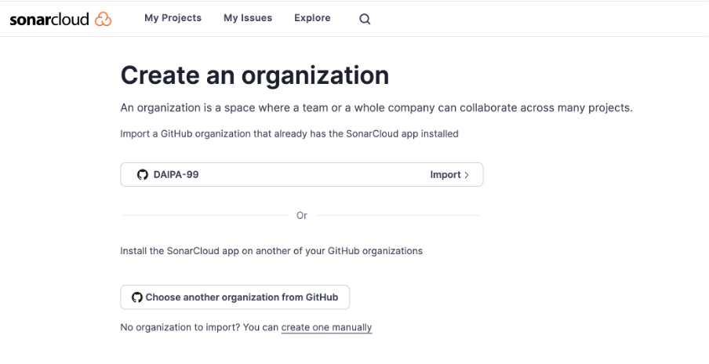

3. Name and Key Generation:
* Provide a name for the organization, and a key will be generated based on the name.

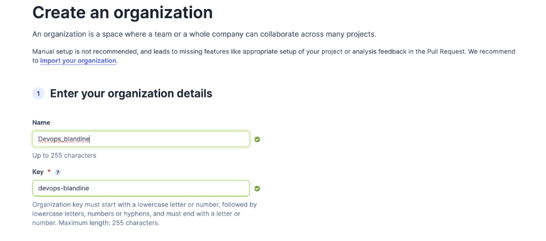

4. Choose Plan and Create:
* Select the free plan and click on "Create Organization."

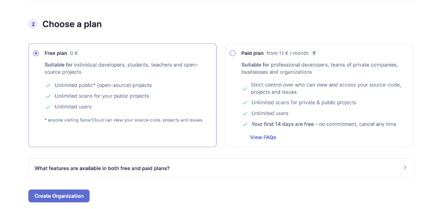

5. Organization Overview:
After creating the organization, you'll see the overview, including the organization name and key.

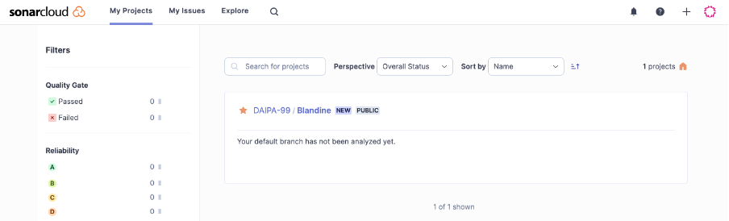

6. Analyze Code:
Navigate to your organization, go into "Branches" -> "Main," and view the analyses of your code.

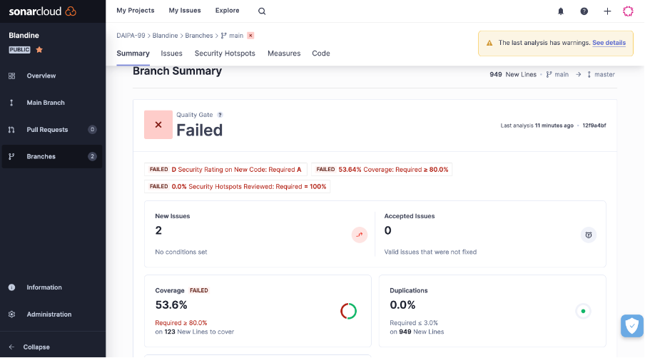

# Explanation

In SonarCloud's code analyses, we observe elements such as New Issues, Accepted Issues, Coverage FAILED, Duplications, and Security Hotspots FAILED. These metrics provide insights into the quality of our code.

* New Issues: This refers to newly identified issues in your codebase since the last analysis. These issues could include bugs, code smells, or security vulnerabilities.

* Accepted Issues: These are existing issues in your codebase that have been acknowledged and accepted without resolution. It's important to track these issues to ensure they are addressed in future development cycles.

* Coverage FAILED: This indicates that the code coverage threshold defined in your project settings has not been met. Code coverage measures the percentage of your codebase that is covered by automated tests. A low coverage percentage may indicate areas of your code that lack proper testing.

* Duplications: This insight identifies code duplication within your codebase. Duplicated code can lead to maintenance challenges, as changes need to be applied to multiple places. Reducing duplication can improve code maintainability and readability.

* Security Hotspots FAILED: Security hotspots are areas of your code that may have security vulnerabilities or weaknesses. A failed security hotspot analysis indicates that these vulnerabilities have been identified and need attention. Addressing security hotspots is crucial for mitigating potential security risks in your application.

## Bonus: split pipelines (Optional)

To achieve this, we need to divide the main.yml file of our workflows into two separate parts and establish a connection to perform testing first, followed by building and pushing images of our containers. Consequently, our workflows will now consist of two separate YAML files: test-backend.yml and build-and-push-docker-image.yml. Here's a glimpse of how these files are structured:

* test-backend.yml:

```yaml
name: Test Backend
 
on:
  push:
    branches:
      - main
      - develop
    
jobs:
  test-backend:
    runs-on: ubuntu-22.04
    steps:
      - uses: actions/checkout@v2.5.0
      - name: Set up JDK 17
        uses: actions/setup-java@v3
        with:
          distribution: 'temurin'
          java-version: '17'
 
      - name: Build and test with Maven
        run: mvn clean -B verify sonar:sonar -Dsonar.projectKey="daipa-99_blandine" -Dsonar.organization="daipa-99" -Dsonar.host.url=https://sonarcloud.io -Dsonar.login=${{secrets.SONAR_TOKEN}} -f ./simple-api-student-main/pom.xml

````

* build-and-push-docker-image.yml:

```yaml
name: Build and Push Docker Image

on:
  workflow_run:
    workflows: ["Test Backend"]
    types:
      - completed
    branches: main

jobs:
  build-and-push-docker-image:
    # run only when code is compiling and tests are passing
    runs-on: ubuntu-22.04

    # steps to perform in job
    steps:
      - name: Checkout code
        uses: actions/checkout@v2.5.0

      - name: Login to DockerHub
        run: docker login -u ${{ secrets.DOCKERHUB_USERNAME }} -p ${{ secrets.DOCKERHUB_TOKEN }}

      - name: Build and push backend
        uses: docker/build-push-action@v3
        with:
          # relative path to the place where source code with Dockerfile is located
          context: ./simple-api-student-main
          # Note: tags has to be all lower-case
          tags: ${{secrets.DOCKERHUB_USERNAME}}/dockercompose-backend:latest
          # build on feature branches, push only on main branch
          push: ${{ github.ref == 'refs/heads/main' }}

      - name: Build and push database
        # DO the same for database
        uses: docker/build-push-action@v3
        with:
          # relative path to the place where source code with Dockerfile is located
          context: ./
          # Note: tags has to be all lower-case
          tags: ${{secrets.DOCKERHUB_USERNAME}}/dockercompose-database:latest
          # build on feature branches, push only on main branch
          push: ${{ github.ref == 'refs/heads/main' }}

      - name: Build and push httpd
        # DO the same for httpd
        uses: docker/build-push-action@v3
        with:
          # relative path to the place where source code with Dockerfile is located
          context: ./http
          # Note: tags has to be all lower-case
          tags: ${{secrets.DOCKERHUB_USERNAME}}/dockercompose-httpd:latest
          # build on feature branches, push only on main branch
          push: ${{ github.ref == 'refs/heads/main' }}

      - name: Build and push frontend
        # DO the same for httpd
        uses: docker/build-push-action@v3
        with:
          # relative path to the place where source code with Dockerfile is located
          context: ./frontend
          # Note: tags has to be all lower-case
          tags: ${{secrets.DOCKERHUB_USERNAME}}/dockercompose-frontend:latest
          # build on feature branches, push only on main branch
          push: ${{ github.ref == 'refs/heads/main' }}
```
And when you push this in actions the job will look like this after execution:

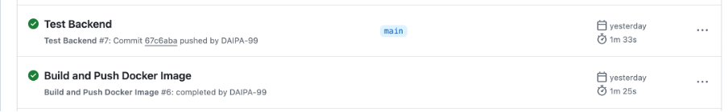


# TP PART 03 - Ansible

# Introduction

# Inventories

First of all we create an ansible project in this directory Devops/my-project/ansible/inventories/ and then we create the file setup.yml with these elements:

```yaml
all:
 vars:
   ansible_user: centos
   ansible_ssh_private_key_file: ~/.ssh/id_rsa
 children:
   prod:
     hosts: blandine.daipa.takima.cloud

```
before this we have download our key id_rsa and copy it into ~/.ssh/id_rsa.
We have to download ansible using this command on our CLI:

```bash
pip install ansible
```
And then we test our inventory with ping command:

```yaml
ansible all -i inventories/setup.yml -m ping
```

and it return pong!

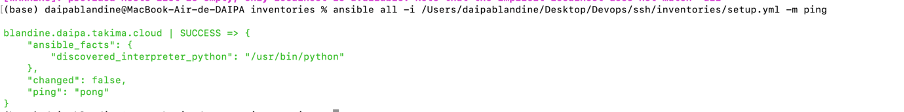

we have to setup module using :

```yaml
ansible all -i inventories/setup.yml -m setup -a "filter=ansible_distribution*"
```
The result look like this :

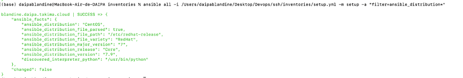

Then desinstalled Apache httpd server on our machine:

```yaml
ansible all -i inventories/setup.yml -m yum -a "name=httpd state=absent" --become
```

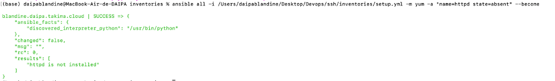

# Playbooks

# First playbook

To initiate our tasks, we need to create a playbook.yml file. Initially, we'll establish a test connection, which will be added to our playbook.yml file as follows:

```yaml
- hosts: all
  gather_facts: false
  become: true

  tasks:
   - name: Test connection
     ping:
```
Execute the playbook using the following command: 

```bash
ansible-playbook -i inventories/setup.yml playbook.yml
```
Upon execution, we obtain the following result:

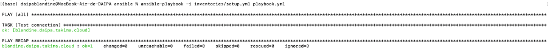

# Advanced Playbook

Now we will create a playbook to install docker, in the same playbook we will put this:

```yaml
- hosts: all
  gather_facts: false
  become: true

# Install Docker
  tasks:

  - name: Install device-mapper-persistent-data
    yum:
      name: device-mapper-persistent-data
      state: latest

  - name: Install lvm2
    yum:
      name: lvm2
      state: latest

  - name: add repo docker
    command:
      cmd: sudo yum-config-manager --add-repo=https://download.docker.com/linux/centos/docker-ce.repo

  - name: Install Docker
    yum:
      name: docker-ce
      state: present

  - name: Install python3
    yum:
      name: python3
      state: present

  - name: Install docker with Python 3
    pip:
      name: docker
      executable: pip3
    vars:
      ansible_python_interpreter: /usr/bin/python3

  - name: Make sure Docker is running
    service: name=docker state=started
    tags: docker
```

The result look like this:

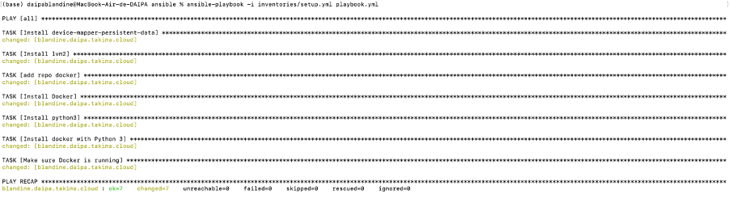

# Using roles

To create a roles we have to use this syntax, for exemple the role od docker :

```yaml
ansible-galaxy init roles/docker
```
We have to this for all our tasks : docker, app, backend, database, network, proxy and later for frontend

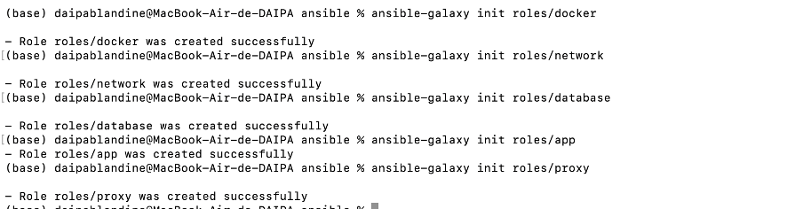

after creating each role we have to put information into main.yml of each rôle. For example the rôle of docker is look like this:

```yaml
---
# install_docker/tasks/main.yml
# Install Docker

- name: Install device-mapper-persistent-data
  yum:
    name: device-mapper-persistent-data
    state: latest

- name: Install lvm2
  yum:
    name: lvm2
    state: latest

- name: add repo docker
  command:
    cmd: sudo yum-config-manager --add-repo=https://download.docker.com/linux/centos/docker-ce.repo

- name: Install Docker
  yum:
    name: docker-ce
    state: present

- name: Install python3
  yum:
    name: python3
    state: present

- name: Install docker with Python 3
  pip:
    name: docker
    executable: pip3
  vars:
    ansible_python_interpreter: /usr/bin/python3

- name: Make sure Docker is running
  service: name=docker state=started
  tags: docker
  vars:
    ansible_python_interpreter: /usr/bin/python3

- name: Log in to Docker Hub
  docker_login:
    username: bdaipa
    password: "@Save2018"
    reauthorize: yes
  vars:
    ansible_python_interpreter: /usr/bin/python3
```
And for database :

```yaml
---
# tasks file for roles/database
- name: Pull database image
  docker_image:
    name: bdaipa/dockercompose-database
    tag: latest
    source: pull

- name: Run database
  docker_container:
    name: my-database
    image: bdaipa/dockercompose-database:latest
    networks:
      - name: "my-network"
  vars:
    ansible_python_interpreter: /usr/bin/python3

```
We just have to change the name and image for the others. we can see it in our files into my-project -> ansible -> roles -> choose one role -> tasks.
<<<<<<< HEAD

=======
>>>>>>> e1313680c0ad61b5321b09763c61a305278c5550
